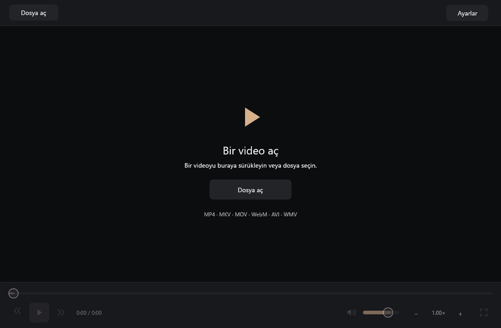
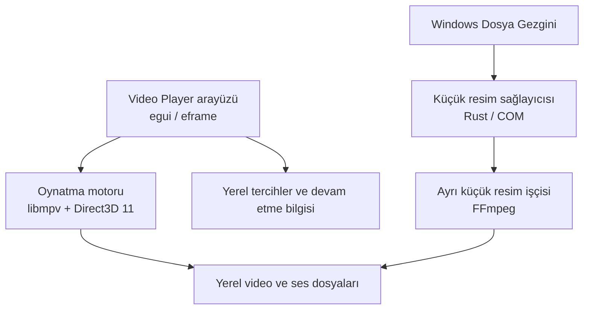

<p align="center">
  
</p>

<h1 align="center">Video Player</h1>

<p align="center">
  <strong>Windows için Rust ile geliştirilen, hız odaklı açık kaynak video ve ses oynatıcı.</strong>
</p>

<p align="center">
  
  
  
  <a href="./LICENSE"></a>
</p>

<p align="center">
  Videolarını aç, kaldığın yerden devam et.<br />
  Dosya Gezgini’nde videolarını küçük resimleriyle bul.
</p>

---

## İndir

<p align="center">
  <strong><a href="https://github.com/serhatkochan/video-player/releases/download/v0.1.0/Video-Player-0.1.0-windows-x64-setup.exe">Video Player 0.1.0 kurulum EXE’sini indir</a></strong><br />
  Windows 11 · Intel/AMD 64 bit
</p>

<p align="center">
  <a href="https://github.com/serhatkochan/video-player/releases">Tüm sürümler ve sürüm notları</a>
</p>

Kurulum EXE’sini indirip çalıştırman yeterli. Kaynak kodu indirmen, Rust kurman veya uygulamayı derlemen gerekmez. Oynatma ve küçük resim üretimi için gerekli medya bileşenleri pakete dahildir; kurulum ve yerel dosya oynatma çevrimdışı çalışır. API anahtarı veya hesap gerekmez.

> **0.1.0 ön sürüm:** Örnek dosyalarda oynatma, yerel küçük resim üretimi ve otomatik kontroller tamamlandı. Temiz Windows kurulumu, Explorer’daki gerçek sağlayıcı kaydı ve varsayılan uygulama geçişi, fiziksel HDR ekranlar ve tüm donanım/format matrisi henüz doğrulanmadı. Test kapsamı ve kalan çalışmalar [kabul raporunda](docs/acceptance/0.1.0.json) kayıtlıdır.

---

## Genel bakış

Video Player, bilgisayarındaki yerel video ve ses dosyalarını oynatmak için Rust ile geliştirildi. HEVC/H.265, AV1 ve yaygın video formatlarını açar; ses ve altyazı parçalarını seçmene, oynatma hızını ayarlamana ve kaldığın yerden devam etmene olanak verir.

Dosya Gezgini için ayrı bir küçük resim sağlayıcısı içerir. Böylece videoların küçük resimlerinin üretilmesi, varsayılan oynatıcı seçiminden bağımsız çalışır.

<p align="center">
  
</p>

<p align="center"><em>Video Player 0.1.0’ın gerçek açılış ekranı.</em></p>

---

## Performans

Hız metriklerini gerçek oynatma altyapısıyla ölçüyoruz. Aşağıdaki sonuçlar **i9-13900K, RTX 4080 ve 32 GB RAM** bulunan Windows 11 cihazında, 1080p H.264/AAC video ile alındı. Bir ısınma denemesi ardından yedi denemenin medyanı kullanıldı; önbellekler sıcaktı.

| Ölçüm | Medyan |
| :--- | ---: |
| Yerel video yüzeyi ve libmpv başlatma | **11,1 ms** |
| Dosya yükleme → ilk oynatma ilerlemesi bildirimi | **325,2 ms** |
| 30. saniyeye hassas sarma konumunun onayı | **20,5 ms** |
| Boşta RAM, çalışma kümesi | **154,6 MiB** |
| 1080p oynatmada RAM, çalışma kümesi | **243,8 MiB** |
| 1080p oynatmada CPU, toplam makine kapasitesi | **%0,246** |

Motor süreleri, libmpv’nin durum bildirimlerini ölçer; ilk görüntünün ekrana düşme süresi değildir. RAM değerleri GPU VRAM’ini içermez. Sonuçlar tek cihaz ve tek örneğe aittir.

[Ölçüm yöntemi ve tekrar çalıştırma](docs/performance.md) · [Yedi denemenin ham sonuçları](docs/benchmarks/0.1.0-windows-x64.json)

### VLC ve mpv ile karşılaştırma

Aynı cihazda aynı 1080p H.264/AAC dosyasını Video Player, VLC ve bağımsız mpv ile oynattık. Her oynatıcı için bir ısınma denemesini ayırıp yedi denemenin medyanını aldık. Aşağıdaki değerler video açılarak başlatılan süreçlere aittir.

| Oynatıcı | Pencere tanıtıcısı oluşması | Oynatmada RAM | Oynatmada CPU |
| :--- | ---: | ---: | ---: |
| **Video Player 0.1.0** | **28,7 ms** | 243,9 MiB | %0,196 |
| VLC 3.0.23 | 131,1 ms | 170,1 MiB | %0,082 |
| mpv 0.41.0, geliştirme derlemesi | 198,2 ms | 158,9 MiB | %0,146 |

Bu testte Video Player’ın pencere tanıtıcısı daha erken oluştu; VLC ve mpv daha az RAM ve CPU kullandı. Pencere metriği ilk görüntünün çizilmesini veya oynatmaya hazır olma süresini ölçmez. Tek cihaz ve tek dosya, bütün videolar için hız sıralaması oluşturmaz.

Önbellekler sıcaktı, oynatıcı sırası dönüşümlüydü ve arayüzlerin boyutları farklıydı. mpv’de D3D11 ve güvenli otomatik donanım çözme test için seçildi; VLC kişisel ayarlardan ayrı bir taşınabilir kopyayla çalıştı. Donanım çözmeyi Video Player ve mpv’de her denemede, VLC’de yalnızca ayrılan ısınma denemesinin günlüğünde doğruladık. CPU makinenin toplam kapasitesine göre, RAM çalışma kümesi olarak ölçüldü; GPU belleği dahil değildir.

[Karşılaştırma yöntemi](docs/performance.md#oynatıcı-karşılaştırması) · [Yedi denemenin karşılaştırma sonuçları](docs/benchmarks/0.1.0-player-comparison.json)

---

## Öne çıkan özellikler

### Oynatma kontrolleri

- Koyu arayüz ve pencere genişliğini kullanan zaman çizgisi.
- Oynat/duraklat, ileri/geri sarma, ses ve sessize alma kontrolleri.
- `0.25×` ile `4×` arasında oynatma hızı.
- Tam ekran ve kullanılmadığında gizlenen kontroller.

### Aynı klasörde dosyalar arasında geçiş

- Video alanının sol ve sağ düğmeleriyle önceki veya sonraki dosyayı aç.
- Dosyalar adlarına göre doğal sırayla gezilir: `video-2`, `video-10` dosyasından önce gelir.
- Video izlerken videolar; ses dinlerken ses dosyaları arasında geçiş yapılır.
- Klasörün ilk ve son dosyasında ilgili geçiş düğmesi pasifleşir.

### Ses ve altyazı

- Birden fazla ses veya altyazı parçası içeren dosyalarda istediğin parçayı seç.
- Harici SRT, ASS/SSA ve VTT altyazılarını yükle.
- ASS/SSA altyazılarının renk, yazı tipi ve konum stillerini kullan.
- Altyazı gecikmesini ayarlayarak görüntüyle senkronize et.

### Windows ile birlikte kullanım

- Dosyaları sürükle bırakarak, **Dosya aç** düğmesiyle veya Dosya Gezgini’nden çift tıklayarak aç.
- Videolar için Dosya Gezgini’nde kareden küçük resim oluştur.
- Uygulamanın **Ayarlar** bölümünden küçük resim ayarlarını ve Windows entegrasyonunu kontrol et.
- Donanım hızlandırmasından yararlan; gerektiğinde yazılımla çözme kullan.
- Türkçe veya İngilizce arayüzü seç ve kaldığın yerden devam et.

---

## Desteklenen formatlar

| Dosya türü | Uzantılar |
| :--- | :--- |
| Video | `.mp4`, `.m4v`, `.mkv`, `.mov`, `.webm`, `.avi`, `.wmv` |
| Ses | `.mp3`, `.aac`, `.m4a`, `.flac`, `.wav` |
| Altyazı | `.srt`, `.ass`, `.ssa`, `.vtt` |

Görüntü kodekleri arasında H.264, HEVC/H.265, AV1, VP8/VP9, MPEG-2, MPEG-4 Part 2 ve WMV/VC-1 bulunur. Videolardaki AAC, Opus, Vorbis, AC-3/E-AC-3 ve DTS ses parçaları da desteklenir.

Dosya uzantısı taşıyıcı biçimini belirtir; görüntü ve ses kodekleri dosyanın içinde bulunur. Örneğin bir `.mkv` dosyası HEVC görüntü, birden fazla ses parçası ve gömülü altyazı içerebilir.

---

## Kurulum ve ilk kullanım

1. [0.1.0 kurulum EXE’sini](https://github.com/serhatkochan/video-player/releases/download/v0.1.0/Video-Player-0.1.0-windows-x64-setup.exe) indirip çalıştır.
2. Kurulumu tamamla ve Video Player’ı aç.
3. **Dosya aç** düğmesine bas veya bir medya dosyasını pencereye sürükle.

Kurulum, yönetici hesabında tüm kullanıcılar için; standart hesapta yalnızca mevcut kullanıcı için yapılır. Windows gerektiğinde normal yönetici iznini ister.

Varsayılan oynatıcı olarak kullanmak için **Windows Ayarları > Uygulamalar > Varsayılan uygulamalar > Video Player** yolunu açıp istediğin dosya türlerini seç.

Küçük resimleri görmek için Dosya Gezgini’nin **Görünüm** menüsünden orta, büyük veya çok büyük simgeleri seç. Küçük resimler görünmüyorsa uygulamanın **Ayarlar** bölümündeki tanılamayı kontrol et.

Ses ve altyazı seçimi, altyazı gecikmesi ve arayüz dili de uygulamanın **Ayarlar** bölümündedir.

---

## Klavye kısayolları

| Kısayol | İşlev |
| :--- | :--- |
| `Ctrl+O` | Dosya aç |
| `Space` | Oynat/duraklat |
| `←` / `→` | Beş saniye geri/ileri sar |
| `F` veya videoya çift tıklama | Tam ekran |
| `Esc` | Tam ekrandan çık |

---

## Teknoloji ve mimari

| Bileşen | Kullanımı |
| :--- | :--- |
| Rust | Uygulama, yerel durum yönetimi ve Windows entegrasyonu |
| egui / eframe | Masaüstü arayüzü ve oynatma kontrolleri |
| libmpv + Direct3D 11 | Yerel video yüzeyi, oynatma ve donanım hızlandırması |
| FFmpeg + Rust COM sağlayıcısı | Dosya Gezgini için ayrı işçide küçük resim üretimi |
| NSIS | Windows kurulum, güncelleme ve kaldırma paketi |



Video, libmpv’nin yerel Windows yüzeyinde gösterilir; arayüz kontrolleri ayrı alanda çizilir. Küçük resim üretimi ise Windows’un süreç izolasyonunu koruyan ayrı bir işçide yürütülür. Teknik ayrıntılar [mimari belgesindedir](docs/architecture.md).

---

## Kaynaktan çalıştırma

Geliştirmek veya kendi derlemeni oluşturmak için Windows 11 x64, Rust 1.98 veya üzeri, MSVC C++ derleme araçları ve Windows SDK gerekir.

```powershell
git clone https://github.com/serhatkochan/video-player.git
cd video-player
./scripts/Get-Runtime.ps1
cargo run -p video-player
```

Yerel kurulum EXE’sini oluşturmak için:

```powershell
./scripts/Build-Windows.ps1
```

Paket `dist/Video-Player-0.1.0-windows-x64-setup.exe` altında oluşturulur. Derleme ve bağımlılık bilgileri [derleme belgesinde](docs/dependencies.md), ilk yayın koşulları [kabul testleri belgesindedir](docs/acceptance.md).

---

## Gizlilik ve güncellemeler

- Hesap, API anahtarı veya abonelik gerekmez.
- Medya dosyaları dışarı gönderilmez.
- Tercihler ve kaldığın yer bilgisi bilgisayarında saklanır.
- Güncelleme kontrolü yalnızca **Ayarlar > Güncellemeleri kontrol et** düğmesine bastığında GitHub’a bağlanır.
- Yeni sürümleri [GitHub Releases](https://github.com/serhatkochan/video-player/releases) sayfasından indirip kurabilirsin.

---

## Lisans

Video Player’ın uygulama kodu [MIT lisansı](LICENSE) ile yayımlanır. Kodu kişisel veya ticari projelerinde kullanabilir, değiştirebilir ve geliştirebilirsin.

libmpv, FFmpeg ve diğer bağımlılıklar kendi lisanslarını korur. Medya bileşenlerinin dağıtım koşulları [üçüncü taraf bildirimlerinde](THIRD_PARTY_NOTICES.md) ve [bağımlılık belgesinde](docs/dependencies.md) açıklanır.
